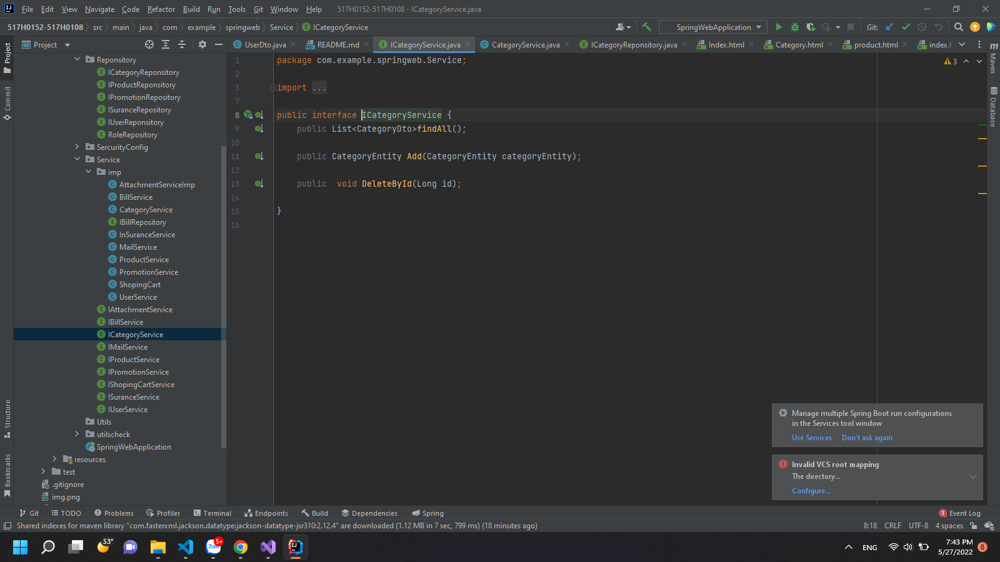

Singleton Pattern
-
Nhằm giảm sự phụ thuộc khi tạo ra đối tượng.
Ví Dụ
- Class A chứa khởi tạo của class B  khi khởi tạo class A đồng thời khởi tạo class B
Giả sử có nhiều class phụ thuộc và ta muốn sử dụng class Từ việc khởi tạo trước kia vậy nên sinh ra Singleton pattern
 Ví dụ áp dụng:
- 
public class EagerInitializedSingleton {

  private static final EagerInitializedSingleton instance = new EagerInitializedSingleton();

  private EagerInitializedSingleton(){}

  public static EagerInitializedSingleton getInstance(){
  return instance;
  }
  }

public class LazyInitializedSingleton {

    private static LazyInitializedSingleton instance;

    private LazyInitializedSingleton(){}

    public static LazyInitializedSingleton getInstance(){
        if(instance == null){
            instance = new LazyInitializedSingleton();
        }
        return instance;
        }
}
public class ThreadSafeSingleton {

    private static ThreadSafeSingleton instance;

    private ThreadSafeSingleton(){}

    public static synchronized ThreadSafeSingleton getInstance(){
        if(instance == null){
            instance = new ThreadSafeSingleton();
        }
        return instance;
     }

}
public class ThreadSafeSingleton {
private static ThreadSafeSingleton instance;
private ThreadSafeSingleton(){}

    public static ThreadSafeSingleton getInstance(){
        if(instance == null){
            synchronized(ThreadSafeSingleton.class){
                if(instance == null){
                   instance = new ThreadSafeSingleton();
                }
            }
        }
        return instance;
     }
}

Trong project được spring hỗ trợ autowire Object miễn khởi tạo là bean
Vd:
 Tại interface CategoryRepository đánh dấu là bean Repository
Vậy để sử các method được implement do spring hỗ trợ chỉ cần autowire tại các class khác cần dùng ví dụ
Tại categoryService

Factory pattern
Nhiệm vụ chủ yếu che giấu logic xử lý, dễ sửa chữa dễ bảo trì
VD:
Tại interface ICategoryService khai bao các method

Còn lớp CategoryService sẽ implement từ ICategoryService và thực thi các method đã được gọi
Vậy Khi khởi tạo chỉ cần ICategoryService categoryService = new CategoryService();
Tuy nhiên spring đã support Anotation @Autowire nên chỉ cần Khai báo bean là có thể lấy được Instance Cùng loại

Abstract Factory
Tạo sự kế thừa từ các abstract class hay interface nhằm quản lý các method cùng loại
Ví dụ ở dưới đây tạo 1 factory các method chung cần được implement từ các lớp thực thi service

Và sau đó interface service extend từ abstract interface 
=> các class thực thi sẽ thực thi các method được khai báo chung trong abstract class

Builder Pattern 
Giải quyết vấn đề truyền tham số khi khởi tạo 1 đối tượng bất kì

documents: [Vibo Builder pattern ](https://viblo.asia/p/builder-design-pattern-6J3ZgjwgKmB)
Vd cách thực thi :
// Product
public class Student {
private String id;
private String firstName;
private String lastName;
private String dayOfBirth;
private String currentClass;
private String phone;

    public Student(String id, String firstName, String lastName, String dayOfBirth, String currentClass, String phone) {
        this.id = id;
        this.firstName = firstName;
        this.lastName = lastName;
        this.dayOfBirth = dayOfBirth;
        this.currentClass = currentClass;
        this.phone = phone;
    }
}

// Builder
public interface StudentBuilder {

    StudentBuilder setId(String id);

    StudentBuilder setFirstName(String firstName);

    StudentBuilder setLastName(String lastName);

    StudentBuilder setDayOfBirth(String dayOfBirth);

    StudentBuilder setCurrentClass(String currentClass);

    StudentBuilder setPhone(String phone);

    Student build();
}

// ConcreteBuilder
public class StudentConcreteBuilder implements StudentBuilder {

    private String id;
    private String firstName;
    private String lastName;
    private String dayOfBirth;
    private String currentClass;
    private String phone;

    @Override
    public StudentBuilder setId(String id) {
        this.id = id;
        return this;
    }

    @Override
    public StudentBuilder setFirstName(String firstName) {
        this.firstName = firstName;
        return this;
    }

    @Override
    public StudentBuilder setLastName(String lastName) {
        this.lastName = lastName;
        return this;
    }

    @Override
    public StudentBuilder setDayOfBirth(String dayOfBirth) {
        this.dayOfBirth = dayOfBirth;
        return this;
    }

    @Override
    public StudentBuilder setCurrentClass(String currentClass) {
        this.currentClass = currentClass;
        return this;
    }

    @Override
    public StudentBuilder setPhone(String phone) {
        this.phone = phone;
        return this;
    }

    @Override
    public Student build() {
        return new Student(id, firstName, lastName, dayOfBirth, currentClass, phone);
    }
}
public static void main(String[] args) {

        StudentBuilder studentBuilder = new StudentConcreteBuilder()
                .setFirstName("Tran")
                .setLastName("Quang Huy");

        System.out.println(studentBuilder.build());
    }

Áp dụng trong project => Spring đã hỗ trọ anotation @Builder của lombok

vậy để áp dụng vào Objec chỉ cần @Builder trên class thì sẽ sử dụng được :

    @GetMapping(value = "/user")
    public String userInformation(Model model){
    Authentication auth = SecurityContextHolder.getContext().getAuthentication();
    UserDto userDto = userService.findUserByName(auth.getName());
    UserEntity user = UserEntity.builder().userId(userDto.getUserId())
    .userName(userDto.getUserName()).build();
    model.addAttribute("UserModel",user);
    return "User";
Prototype Pattern
-
Document [Top Dev Protorypy](https://topdev.vn/blog/prototype-pattern-mot-trong-nhung-pattern-pho-bien-nhat/)

Tái sử dụng code của những class có tính chất chung :
Trong project Khi khởi tạo các đối tượng entity. Mặc định sẽ có trường cố định
ID => type Long
CreateDate=>date
ModifyDate=>date
CreateBy=>String
ModifyBy=>String
Vậy chỉ cần tạo 1 class AbstractEntity có các thuộc tính trên và các lớp entit kế thừa lại
Thì các lớp entity sẽ có Các trường trên mà không cần phải thêm lại

 run project => config connection db at file
 application.properties => run
 at table role create Role: ROLE_ADMIN and ROLE_USER
 access localhost:8082/register => create account and set ROLE_ADMIN
 Access /Admin 